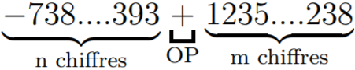
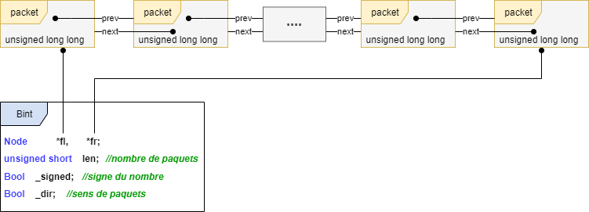

## Implémentation des opérations arithmétiques sur les grands nombres

Les grands nombres sont largement utilisés dans de nombreuses applications:
- Cryptographie : RSA (par exemple)
- Signature des documents
- Fonctions de hachage
- etc

Bien que le type de données «*long long int*» puisse stocker de grands nombres entiers, il ne peut
pas stocker des valeurs extrêmement grandes telles qu’un entier à 200 chiffres par exemple.
Nous souhaitons donc stocker ces grands nombres (techniquement, les nombres plus de 20 chiffres)
dans une structure de données permettant d’effectuer les opérations arithmétiques de base, il
s'agit notamment de munir cette structure par les opérations arithmétiques telles que +, -, ∗, /, %.
```
( n chiffres ) OP ( m chiffres )
```
Exemple: 

Pour pouvoir manipuler les grands nombres et ses opérations arithmétiques, il faut franchir plusieurs étapes:
1. ****Lire les deux nombres entrés par l’utilisateur comme une chaîne de caractères.****
2. ****Vérifier lexicalement la chaîne de caractères:****
```
BINT "-" ?[0 -9]+
```
3. ****Déterminer la taille de paquet convenable à l’opération arithmétique choisie:****</br>
Un paquet de type *unsigned long long int* peut stocker jusqu’à 20 chiffres
(ULLONG_MAX = 2<sup>64</sup> − 1 = 18446744073709551615)</br></br>
Nous voulons garantir que:</br>
∀*p1, p2* deux paquets de taille *n* chiffres, ∀α ∈ {+, −, ∗, /, %}</br>
*p1αp2 = p3* avec *p3* est un paquet de taille toujours inférieure ou égale à *n*.</br>
   1. ##### La formule pour calculer la taille maximale des paquets pour les opérations +, -, /, % :</br>
   }-2)</br>
   En langage C: 
   ```c
   max_p = snprintf(NULL , 0 , "%llu", ULLONG_MAX) - 2;
   ```
   2. ##### La formule pour calculer la taille de paquet pour l’opération de multiplication ∗ est:</br>
   }}{2}-1)</br>
   En langage C:
   ```c
   max_p = snprintf(NULL , 0 , "%llu", ULLONG_MAX)/2 - 1;
   ```
4. ****Déterminer le nombre de paquets à insérer pour une chaîne donnée:****
   - Le nombre de paquets:</br>}}{\text{max\_p}}$)
   - La taille du dernier paquet à insérer:</br>last_p = strlen(str) (*mod* max_p)</br>
   %3A%7D%5Ctext%7Best%20une%20fonction%20qui%20permet%20de%20calculer%20la%20longueur%20d'une%20cha%C3%AEne%20de%20caract%C3%A8res%7D%5C%5C%0A%20%20%5Ctextit%7Bstr%3A%7D%5Ctext%7Best%20la%20cha%C3%AEne%20entr%C3%A9%20par%20l'utilisateur%7D%5C%5C%0A%5Ctextit%7Bmax%5C_p%3A%7D%5Ctext%7Best%20la%20taille%20de%20paquet%20calcul%C3%A9e%20pr%C3%A9c%C3%A9demment%20%C3%A0%20l'%C3%A9tape%20(3)%7D%5C%5C%0A%5Cend%7Bcases%7D)
5. ****Insérer les paquets dans une structure de données chaînée**** (Voir la figure ci-dessous)
<p align="center">
  
  <p align="center">Fig1: Structure de données utilisée pour stocker les grands nombres</p>
</p>

L'opération d’insertion se fait toujours en tête de liste, cela permet de réduire la complexité de la conversion (chaîne de caractères → liste chainée)
en *O(nb)* où *nb* est le nombre de paquets précédemment calculé à l’étape (4).

6. ****Phase de pré-calcul, traitement des cas triviaux et du signe du résultat:****
   - Calculer \(n1 + n2\) avec *n1* et *n2* de signe différent revient à calculer:</br>
   
   - Calculer \(n1 - n2\) avec *n1* et *n2* de signe différent équivaut à calculer \(|n1|+|n2|\); Le signe du résultat est celui de n1.
   - Calculer \(n1 - n2\) avec *n1* et *n2* sont de même signe revient à calculer:
   
   - Calculer  avec *n2*=0 devrait déclencher une exception d'erreur.
   - Calculer  avec |n1|<|n2| est égale à 0.
   - etc.

7. ****Implémenter les méthodes et opérations arithmétiques nécessaires.****

